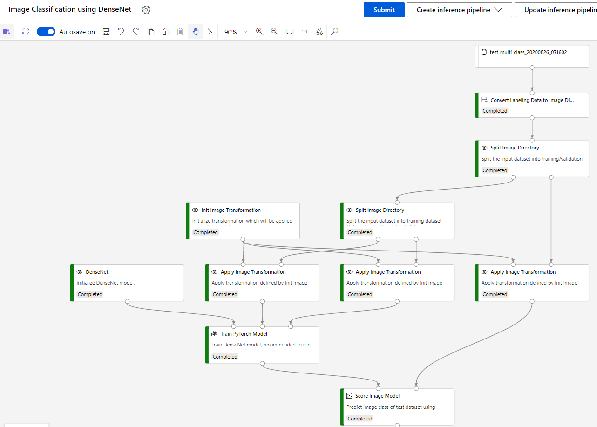

Convert Labeling Data to Image Directory Module
=========================================
This module is to convert "Data Labeling" export dataset to 'Designer' image directory.

Dataset
-----------------------------
Exported dataset as Azure ML Dataset in "Data Labeling" project. Type 'Image Classification Multi-class' and 'Image Classification Multi-label' are supported in this module.

Sample pipeline graph
-----------------------------
In this example, we use this module to replace "Convert to Image Directory" module in sample "Image Classification using DenseNet".

