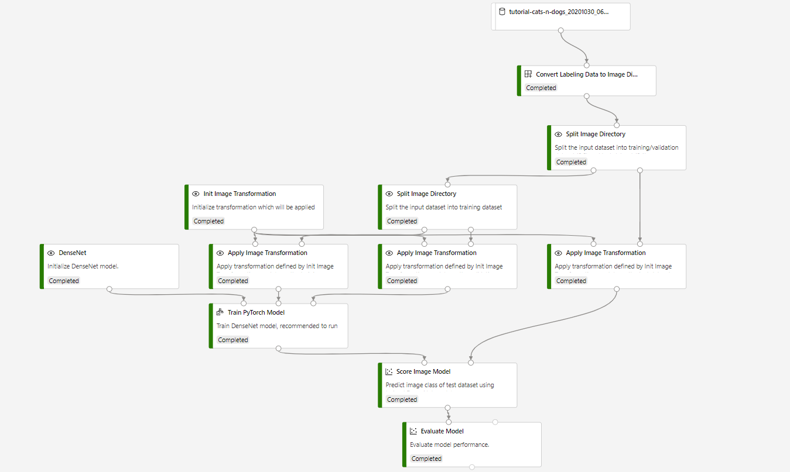

# Image classification using AML labeling dataset 

## Overview

This sample pipeline contains some components that implement with image classification scenarios.

This pipeline build a image classification model using AML labeling dataset.

#### You will learn how to:

Build pipeline with newly created components and some built-in components in the designer.

## Prerequisites

- [Create related components in your workspace](.../tutorial/tutorial1-use-existing-components.md).
- A registered dataset exported from AML Data Labeling.

## Build the pipeline

1. Drag the labeling dataset into canvas.

1. Add **Convert Labeling Data to Image Directory** to canvas, connect it to the dataset, and configure the parameters.

1. Add built-in modules from the **Computer Vision** category and connect them like following:

## Related components
| Component spec               | Description                                                  |
| --- |--- |
|[Convert Labeling Data to Image Directory](.../components/convert-labeling-data-to-image-directory/convert_labeling_data_to_image_directory.spec)| Convert AML labeling dataset to Image Directory which can be used in Designer. 

| Contributed by |  Tags | Last update | 
|---|---|---|
| Microsoft | recommendation| December, 2020 |

