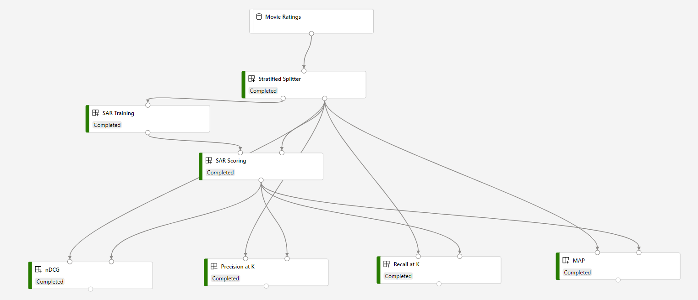

# Simple Algorithm for Recommendation 

## Overview

This sample pipeline contains some components that implement with Simple Algorithm for recommendation scenarios.

Simple Algorithm for Recommendation (SAR) is a fast and scalable algorithm for personalized recommendations based on user transaction history. It produces easily explainable and interpretable recommendations and handles "cold item" and "semi-cold user" scenarios. SAR is a kind of neighborhood based algorithm (as discussed in [Recommender Systems by Aggarwal](https://dl.acm.org/doi/book/10.5555/2931100)) which is intended for ranking top items for each user. Recommenders are commonly used in recommendation of movies, restaurants, etc.

#### You will learn how to:

Build pipeline with newly created components and AzureML sample dataset.

## Prerequisites

[Create related components in your workspace](../tutorial/tutorial1-use-existing-components.md).

## Build the pipeline

1. Open Designer, and drag the **Movie Ratings** dataset to canvas.

   If you have your own dataset, it should be a tabular dataset with following format:

   | User ID | Movie ID | Rating | Timestamp |
   | ---     | ---      | ---    | ---       |
   | 1 | 68646 | 10 | 1381920027|  
   | 1 | 113277 | 10| 1379466669| 
   | 2 | 454876 | 8 | 1394818630| 

1. Add **Stratified Splitter** to canvas, connect it to the dataset, and configure the parameters.

1. Add **SAR Training** to canvas, input the **User column** name, **Item column**, **Rating column** and **Timestamp column**.

1. Add **SAR Scoring** to canvas, you can choose the Score type, either *Rating prediction* or *Item recommendation*, then select the **Ranking metric** used for *Item recommendation*.

1. Add one or more of **Recall at K**, **Precision at K**, **MAP** and **nDCG** to evaluate the scoring result. Connect these modules like following:

1. Submit the pipeline.

## Related components
| Component spec               | Description                                                  |
| --- |--- |
[Stratified Splitter](https://github.com/microsoft/recommenders/blob/master/reco_utils/azureml/azureml_designer_modules/module_specs/stratified_splitter.yaml)| Split dataset into training dataset and test dataset. |
| [SAR Training](https://github.com/microsoft/recommenders/blob/master/reco_utils/azureml/azureml_designer_modules/module_specs/sar_train.yaml)| Train a simple algorithm recommender. |
| [SAR Scoring](https://github.com/microsoft/recommenders/blob/master/reco_utils/azureml/azureml_designer_modules/module_specs/sar_score.yaml)| Using test dataset to score the trained recommender.|
| [MAP](https://github.com/microsoft/recommenders/blob/master/reco_utils/azureml/azureml_designer_modules/module_specs/map.yaml)| Mean Average Precision at K metric. |
| [nDCG](https://github.com/microsoft/recommenders/blob/master/reco_utils/azureml/azureml_designer_modules/module_specs/ndcg.yaml)| Normalized Discounted Cumulative Gain (nDCG) at K metric.|
| [Precision at K](https://github.com/microsoft/recommenders/blob/master/reco_utils/azureml/azureml_designer_modules/module_specs/precision_at_k.yaml)| Precision at K metric. |
| [Recall at K](https://github.com/microsoft/recommenders/blob/master/reco_utils/azureml/azureml_designer_modules/module_specs/recall_at_k.yaml)| Recall at K metric. |

| Contributed by | Tags | Last updated on | 
|---|---|---|
| Microsoft |recommendation| September 4, 2020 |

