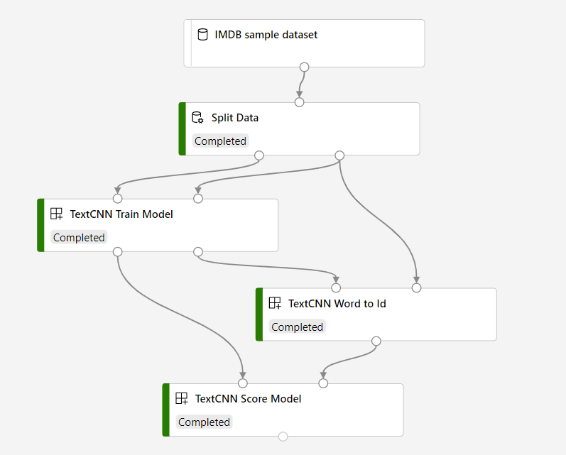

# Text classification by convolutional neural network

## Overview

This sample pipeline contains some components that implement with Text CNN for sentiment classification scenarios.

The goal of text classification is to assign some piece of text to one or more predefined classes or categories. The piece of text could be a document, news article, search query, email, tweet, support tickets, customer feedback, user product review etc. Applications of text classification include categorizing newspaper articles and news wire contents into topics, organizing web pages into hierarchical categories, filtering spam email, sentiment analysis, predicting user intent from search queries, routing support tickets, and analyzing customer feedback. As part of the Azure Machine Learning offering, Microsoft provides a template to help data scientists easily build and deploy a text sentiment binary classification solution. In this document, you will learn how to use and customize the template through a demo use case.

#### You will learn how to:

Build pipeline with newly created components and AzureML built-in components.

## Prerequisites

[Create related components in your workspace](.../tutorial/tutorial1-use-existing-components.md).

## Build the pipeline

1. Register a text dataset as file dataset in your workspace. The dataset format should be like [IMDB Dataset of 50k Movie Reviews](https://www.kaggle.com/lakshmi25npathi/imdb-dataset-of-50k-movie-reviews)

1. Open Designer, and drag the dataset to canvas.

1. Add **Split Data** to canvas, connect it to the dataset, and configure the parameters.

1. Add **TextCNN Train Model** to canvas, input the **label_column_name** (the sentiment column), **true_label_value** and **text_column_name** (the column contains text).

1. Add **TextCNN Word to Id** to canvas, input the **text_column_name**.

1. Add **TextCNN Score Model** to canvas. Connect these modules like following:

1. Submit the pipeline.

1. After the pipeline run is completed, you can check the `Precision, Recall and F1-Score` and `precision-recall curve` under **Outputs+logs** tab in the right pane of **TextCNN Score Model**. 

## Related components
| Component spec               | Description                                                  |
| --- |--- |
| [textcnn-train](.../components/textcnn/textcnn-train/train.yaml) | A module to perform training of a text classicification model from scratch using pytorch |
| [textcnn-preprocess](.../components/textcnn/textcnn-preprocess/preprocess.yaml) | A module to preprocess input text before scoring. |
| [textcnn-score](.../components/textcnn/textcnn-score/score.yaml) | A module to score text classification model. |

| Contributed by | Maintained by | Category | Tags | Last update | 
|---|---|---|---|---|
| Microsoft | @Microsoft Open Source | Tutorials |text-processing, text-classification, CNN| September 4, 2020 |

