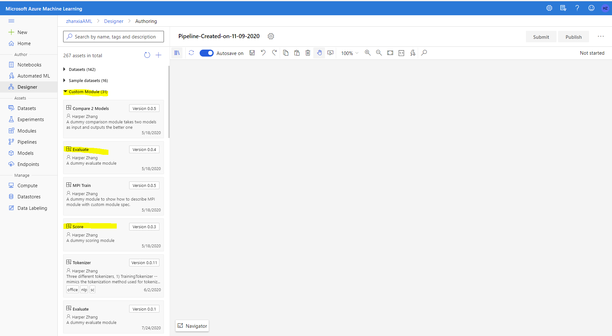
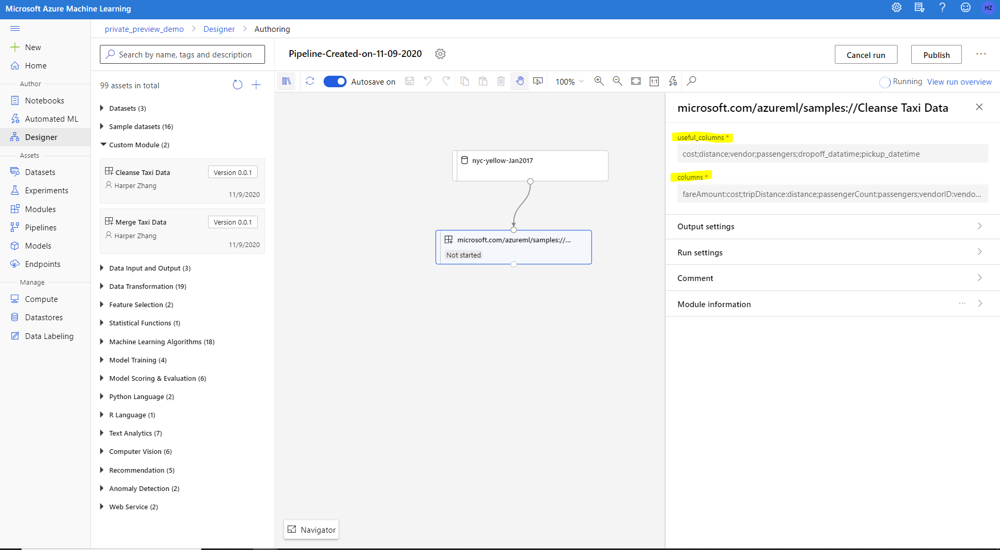

# Tutorial-1 Use existing components from gallery

A component is self-contained set of code that performs one step in the ML workflow (pipeline), such as data preprocessing, model training, model scoring and so on. A component is analogous to a function, in that it has a name, parameters, expects certain input and returns some value. Any python script can be wrapped as a component following the [component spec](component-spec-definition.md).

Azure Machine Learning Gallery contains rich components and pipelines for common machine learning tasks. It accelerates the productivity by enabling customer easily leveraging best work of the community instead of start from zero. 

In this tutorial you will learn how to build a machine learning pipeline with existing components in the gallery. It can be summarized as two steps:
 1. Register the components to your Azure Machine Learning workspace.
 2. Build the pipeline using the registered components in Azure Machine Learning designer.

This tutorial will use NYC Taxi Fare Prediction as an example. The related components can be found under components/nyc-taxi-fare-prediction.


## 1. Register existing components from gallery

This tutorial will explain how to register component from the gallery with 3 sample components (cleanse, merge, filter) under folder components/nyc-taxi-fare-prediction.

1. Go to ml.azure.com and select your workspace.
1. Add flight=cm at end of the URL to enable components feature. You will see Components tab under Assests blade on the left navigation area. 

    [Note] Please open designer before you do following steps if you never opened designer in your workspace before. This is to make sure the needed data type is registered to the workspace. 
1. Click *Create new component -> From YAML file*. Chose Github repo as source. Fill in the URL of cleanse component YAML spec file (https://github.com/Azure/AzureMachineLearningGallery/blob/main/components/nyc-taxi-fare-prediction/cleanse/cleanse_spec.yaml).

    
    

1. Follow the wizard to finish the creation. After creation you will see the component both in component tab and Designer palette on the left. 
1. Repeat 1-4 for merge_spec.yaml to register Merge Taxi Data and Train XGBoost Model component to your workspace. Check the left palette in designer, you should be able to see the registered components there.



## 2. Use registered component to build pipeline in designer

Azure Machine Learning designer is the UI interface to build machine learning pipelines. It provides an easy to use drag-n-drop interface to build, test and manage your machine learning pipelines. 

1. Create NYC Taxi dataset that will be used in the pipeline.

    We will use the NYC Taxi fare data hosted in Azure Open Datasets. We have put sample data of Jan 2016 under ./tutorial/data. Please download the data and register them as **tabular dataset** to your workspace. You can simply register from the dataset UI in AML Studio.    

1. Drag and drop the components and dataset in designer. You can right click the dataset and click **Visualize** to preview the data.

1. Connect them to build the pipeline. 

    The Clean Taxi Data component has two parameters. ```useful_columns``` is a list of columns that will be picked for following processing. ```columns``` is the column rename mapping dictionary. Since the nyc-taxi-yellow and nyc-taxi-green data have different column names, we need to rename the columns to unified names. ```columns``` captures the original column names and the unified new names that used in ```useful_columns```
    

1. Submit a run.
    
    Select a compute target and submit a run. 

1. Check result of the run.
    
    If the run finish successfully, each component's output will be stored in the workspace default blob. 
    You can preview the output by **Visualize** or access the output in storage account by **View Output** in the right click menu of the component.

     If the run failed, check the 70_driver_log under Outputs + Logs to troubleshot. 
  


## Next step
This tutorial goes through how to use existing components from the gallery to build a machine learning pipeline. Follow the [second part of the tutorial](./tutorial2-create-your-component.md) to learn how to create a component with your own code. 
