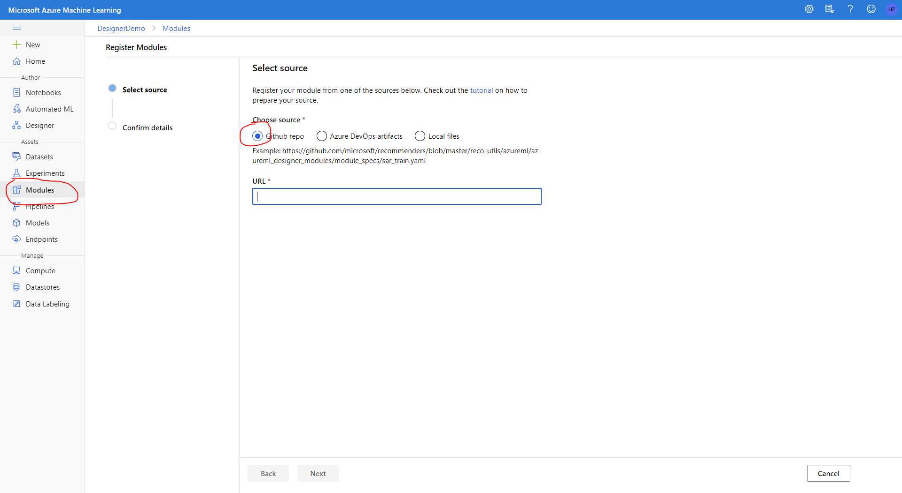

# Tutorial-1 Use existing components from gallery

A component is self-contained set of code that performs one step in the ML workflow (pipeline), such as data preprocessing, model training, model scoring and so on. A component is analogous to a function, in that it has a name, parameters, expects certain input and returns some value. Any python script can be wrapped as a component following the [component spec](component-spec-definition.md).

Azure Machine Learning Gallery contains rich components and pipelines for common machine learning tasks. It accelerates the productivity by enabling customer easily leveraging best work of the community instead of start from zero. 

In this tutorial you will learn how to build a machine learning pipeline with existing components in the gallery. It can be summarized as two steps:
 1. Register the components to your Azure Machine Learning workspace.
 2. Build the pipeline using the registered components in Azure Machine Learning designer.

## 1. Register existing components from gallery

This tutorial will explain how to register component from the gallery with 3 dump components under folder components/get-started.

1. Go to ml.azure.com and select your workspace.
1. Add flight=cm at end of the URL to enable components feature. You will see Components tab under Assests blade on the left navigation area. 
1. Click *Create new component -> From YAML file*. Chose Github repo as source. Fill in the URL of component YAML spec file. 

    
    

1. Follow the wizard to finish the creation. After creation you will see the component both in component tab and Designer palette on the left. 
1. Repeat 1-4 for score.yaml and evaluate.yaml to register score and evaluate component to your workspace.

## 2. Use registered component to build pipeline in designer

Azure Machine Learning designer is the UI interface to build machine learning pipelines. It provides an easy to use drag-n-drop interface to build, test and manage your machine learning pipelines. 

1. Create a dataset that will be used in the pipeline
1. Drag and drop the components and dataset.
1. Connect them to build the pipeline. 
1. Submit a run to compute target.
1. Check result of the pipeline.

## Next step
This tutorial goes through how to use existing components from the gallery to build a machine learning pipeline. Follow the second part of the tutorial to learn how to create a component with your own code. 
