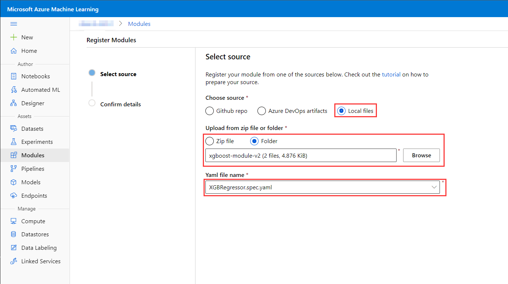
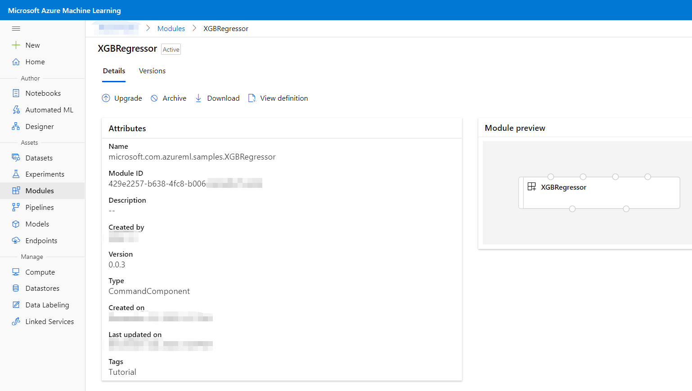

# Tutorial 2: Create your own component

In [tutorial 1](./tutorial1-use-existing-components.md), you learned how to use existing components in the gallery. What if the component you want is not in the gallery but you have the local code with the similar functionality? The suggested way is to create your own component and share it in the gallery. Then you can reuse it anytime and the new component could also be used with others. This tutorial will help you on the step by step to create a new component from your local code.

## Prerequsite
Let's continue with the NYC taxi fare prediction case in [tutorial 1](./tutorial1-use-existing-components.md) to create a new component. Assume we do not have exsiting nyc-taxi-fare-prediction components in the galary, but instead, we have below local code to train NYC taxi fare prediction model by using `xgb.XGBRegressor`. 

```python
from sklearn.metrics import mean_squared_error
from sklearn.model_selection import train_test_split
import pandas as pd
import numpy as np
import xgboost as xgb

## Training data preparation
data = pd.read_csv('NYC-taxi-fare.csv')
data.head(10)
data = data.iloc[:,2:7]
data.head()
X, y = data.iloc[:,1:],data.iloc[:,0]

## Training
X_train, X_test, y_train, y_test = train_test_split(X, y, test_size=0.2, random_state=123)
xg_reg = xgb.XGBRegressor(objective ='reg:linear', colsample_bytree = 0.3, learning_rate = 0.1,
                max_depth = 5, alpha = 10, n_estimators = 10)
xg_reg.fit(X_train,y_train)

## Evaluation
preds = xg_reg.predict(X_test)
rmse = np.sqrt(mean_squared_error(y_test, preds))
print("RMSE: %f" % (rmse))

## Output model
xg_reg.save_model('xgb_modelfile.json')
```

Right now, we plan to create XGBRegressor component which includes the core training/evaluation functions. Then the new component could be easily reused for training new model with the new taxi fare data or other prediction pipeline. 

## Create XGBRegressor component from code
In general, Azure Machine Learning component is constituted by 2 files: 1) Component specification in Yaml format (i.e. Yaml Spec). 2) Relative Python code which includes your own logic (i.e. Py Code). Following this guideline, here is the suggested step-by-step to create a new component:
1. Prepare the Yaml Spec for the new component. This include several sub-steps
    1. Fill component __Metadata__.
    2. Define the __Interface__ of component.
    3. Define the __Command Line__ of component.
    4. Declare the __Environment__.
2. Upgrade local code to be compatible with Yaml Spec. This include several sub-steps
    1. Parse input values of component.
    2. Upgrade core function with the variable inputs.
    3. Manage the output of component.

### Create Yaml Spec 
In this section, we will go through 4 steps to create Yaml Spec for our new XGBRegressor component. But this example may not cover all the available settings and value constraints. So we strongly recommand you to read [component spec definition](../component-spec-definition.md) for more details before you create your own component.

#### Step 1 - Metadata
Metadata is the starting point to create the component to define the basis of the component(i.e. name, version) and its extensible tags. In our XGBRegressor component, let's use the 'microsoft.com.azureml.samples.XGBRegressor' as the name and 'XGBRegressor' as the display name on UI. To facilitate others on the understanding of this component, we could also add tags like 'Tutorial' to this component.

The Yaml content of XGBRegressor metadata would be:
```yaml
$schema: http://azureml/sdk-2-0/CommandComponent.json
name: microsoft.com.azureml.samples.XGBRegressor
version: 0.0.1
display_name: XGBRegressor
type: CommandComponent
is_deterministic: false
tags:
  Tutorial:
```
[Note] Name is the unique identifier across all components. Currently, name only accept letters, numbers and '-._'.
[Note] Currently, Azure Machine Learning Component only support __CommandComponent__. So the `schema` and `type` settings are fixed values for CommandComponent.

#### Step 2 - Interface.
Interface is the central place to define the inputs and outputs of a component. For our case, we need to define 2 kinds of input: data and model parameters, and 2 output: model file and evaluation result.

##### Inputs
When we define our XGBRegressor component __data inputs__, We would assume the data which flows into our component has already been cleaned and splitted by the precedent components. Then we need to declare 4 data inputs:
- Feature table used for training.
- Lable vector used for training.
- Feature table used for evaluation.
- Lable vector used for evaluation.

Each of them is defined like the following sample Yaml under 'inputs' setting:

```yaml
inputs:
  Training_Data_Features:
    type: DataFrameDirectory
    optional: false
  ## Other inputs <...>
```
[Note] DataFrameDirectory is the common data interface when uses Azure Machine Learning datasets. This type could be easily transformed to Pandas DataFrame. It is suggested to use DataFrameDirectory as the data inputs/outputs when you define your components.

When we consider the __parameter inputs__ for our XGBRegressor component, the variables which are used for initiating XGBRegressor should be the best candidtes of parameter as we may need different value for the futher tuning. This time, we'd like to define the following parameters for our component:
- colsample_bytree. Subsample ratio of columns when constructing each tree.
- Learning_rate. Boosting learning rate
- Max_depth. Maximum tree depth for base learners.
- N_estimators. Number of trees in random forest to fit.

Each of the parameter is defined like the following sample Yaml under `'inputs'` setting:

```yaml
inputs:
  ## Data inputs <...>
  Colsample_bytree:
    type: Float
    default: 0.3
    optional: false
    description: Subsample ratio of columns when constructing each tree.
  ## Other param inputs <...>
```

[Note] When you use DataFrameDirectory or directory(e.g. path) as a input type, it will be shown as a linkable point (i.e. the __port__) on the component box on the canvas. When you use basic type, e.g. integer, Float, String as a input type, it will be treated as __parameters__ of the component and all parameters could be set on the right pannel when click on one component. Please refer to [component spec definition](../component-spec-definition.md) for the type full list of __port__ and __parameters__.
[Note] The `description` under each input will help the user to understanding the meaning of this input. When the user hover the mouse on a port, or hover on the question mark of a parameter on the right panel, the description is shown as a pop up text.

##### Outputs
In xgboost SDK, we could output the trained model to a Json file for the futher usage(e.g. offline inference). So we could define a path to store our model Json file as the model output. At the meanwhile, evaluation result is also important to judge the performace of a model. Currently, given Azure Machine Learning ouly support __port__ output, we need put our evaluation result to a single line of data with DataFrameDiretory format. The output Yaml is defined

```yaml
outputs:
  Model_Path:
    type: path
  Evaluation_Result:
    type: DataFrameDirectory
```

#### Step 3 - Commandline.
For CommandComponent,  we need define 1 line command under `command` setting to run the core logic. Usually it directly call your python script with the proper inputs/outputs values.

```yaml
command: >-
  python XGBRegressor.py 
  --Training_Data_Features {inputs.Training_Data_Features} 
  --Training_Data_Lable {inputs.Training_Data_Lable} 
  --Evaluation_Data_Features {inputs.Evaluation_Data_Features} 
  --Evaluation_Data_Lable {inputs.Evaluation_Data_Lable} 
  --Colsample_bytree {inputs.Colsample_bytree} 
  --Learning_rate {inputs.Learning_rate}
  --Max_depth {inputs.Max_depth} 
  --N_estimators {inputs.N_estimators}
  --Model_Path {outputs.Model_Path} 
  --Evaluation_Result {outputs.Evaluation_Result}
```
#### Step 4 - Envrionment.
`'environment'` in Yaml spec is used for defining your running environment includes docker image, python conda config and operating system. In our XGBRegressor component, we use the default azureml docker image and Linux os. For conda environment, we leverage the default Azure Machine Learning conda config but add __xgboost__ as an extra dependency for our environment:

```yaml
environment:
  docker:
    image: mcr.microsoft.com/azureml/intelmpi2018.3-ubuntu16.04
  conda:
    conda_dependencies:
      name: project_environment
      channels:
      - defaults
      dependencies:
      - python=3.7.6
      - pip=20.0
      - pip:
        - azureml-sdk==0.1.0.*
        - azureml-designer-core==0.0.31
        - azureml-dataset-runtime[fuse,pandas]
        - --index-url https://azuremlsdktestpypi.azureedge.net/dev/aml/office/134157926D8F
        - --extra-index-url https://pypi.org/simple
        - pyarrow
        - pandas
        - scikit-learn
        - numpy
        - xgboost
  os: Linux
```

#### Summary of Yaml Spec
After following the core 4 steps, we now have our full Yaml spec for XGBRegressor component:
```yaml
#  This is a tutorial component spec yaml file for XGBRegressor.
#  For more details, please refer to https://aka.ms/azure-ml-component-specs
$schema: http://azureml/sdk-2-0/CommandComponent.json
name: microsoft.com.azureml.samples.XGBRegressor
version: 0.0.3
display_name: XGBRegressor
type: CommandComponent
is_deterministic: false
tags:
  Tutorial:
inputs:
  Training_Data_Features:
    type: DataFrameDirectory
    optional: false
  Training_Data_Lable:
    type: DataFrameDirectory
    optional: false
  Evaluation_Data_Features:
    type: DataFrameDirectory
    optional: false
  Evaluation_Data_Lable:
    type: DataFrameDirectory
    optional: false
  Colsample_bytree:
    type: Float
    default: 0.3
    optional: false
    description: Subsample ratio of columns when constructing each tree.
  Learning_rate:
    type: Float
    default: 0.1
    optional: false
    description: Boosting learning rate
  Max_depth:
    type: Integer
    default: 5
    optional: false
    description: Maximum tree depth for base learners.
  N_estimators:
    type: Integer
    default: 10
    optional: false
    description: Number of trees in random forest to fit.
outputs:
  Model_Path:
    type: path
  Evaluation_Result:
    type: DataFrameDirectory
command: >-
  python XGBRegressor.py 
  --Training_Data_Features {inputs.Training_Data_Features} 
  --Training_Data_Lable {inputs.Training_Data_Lable} 
  --Evaluation_Data_Features {inputs.Evaluation_Data_Features} 
  --Evaluation_Data_Lable {inputs.Evaluation_Data_Lable} 
  --Colsample_bytree {inputs.Colsample_bytree} 
  --Learning_rate {inputs.Learning_rate}
  --Max_depth {inputs.Max_depth} 
  --N_estimators {inputs.N_estimators}
  --Model_Path {outputs.Model_Path} 
  --Evaluation_Result {outputs.Evaluation_Result}
environment:
  docker:
    image: mcr.microsoft.com/azureml/intelmpi2018.3-ubuntu16.04
  conda:
    conda_dependencies:
      name: project_environment
      channels:
      - defaults
      dependencies:
      - python=3.7.6
      - pip=20.0
      - pip:
        - azureml-sdk==0.1.0.*
        - azureml-designer-core==0.0.31
        - azureml-dataset-runtime[fuse,pandas]
        - --index-url https://azuremlsdktestpypi.azureedge.net/dev/aml/office/134157926D8F
        - --extra-index-url https://pypi.org/simple
        - pyarrow
        - pandas
        - scikit-learn
        - numpy
        - xgboost
  os: Linux
```

### Upgrade Py Code
Upgrade our local py code to module py code is much easier than create Yaml spec. We just need 3 steps based on our local code:
- Import necessary Azure Machine Learning libs. e.g. azureml.studio.core.io.data_frame_directory to support DataFrameDirectory.
- Parse all inputs from args and call XGBRegressor training with these input values. 
- Create output folders and write the result to those location.

Base on the local python code and our component interface defination, here is the full Py code for XGBRegressor component:
```python
import os
import sys
import argparse
import pandas as pd
import numpy as np
from pathlib import Path
from sklearn.metrics import mean_squared_error

from azureml.studio.core.io.data_frame_directory import load_data_frame_from_directory, save_data_frame_to_directory

import xgboost as xgb

## Parse args
parser = argparse.ArgumentParser("XGBRegressor")
parser.add_argument("--Training_Data_Features", type=str, help="Features of training dataset.")
parser.add_argument("--Training_Data_Lable", type=str, help="Lable of training dataset.")
parser.add_argument("--Evaluation_Data_Features", type=str, help="Features of evaluation dataset.")
parser.add_argument("--Evaluation_Data_Lable", type=str, help="Lable of evaluation dataset.")

parser.add_argument("--Colsample_bytree", type=float, help="Subsample ratio of columns when constructing each tree.")
parser.add_argument("--Learning_rate", type=float, help="Boosting learning rate.")
parser.add_argument("--Max_depth", type=int, help="Maximum tree depth for base learners.")
parser.add_argument("--N_estimators", type=int, help="Number of trees in random forest to fit.")
parser.add_argument("--Model_Path", type=str, help="Path to store XGBoost model file in Json format.")
parser.add_argument("--Evaluation_Result", type=str, help="Evaluation result")

args = parser.parse_args()

## Load data from DataFrameDirectory to Pandas DataFrame
training_df_features = load_data_frame_from_directory(args.Training_Data_Features).data
training_df_lable = load_data_frame_from_directory(args.Training_Data_Lable).data
evaluation_df_features = load_data_frame_from_directory(args.Evaluation_Data_Features).data
evaluation_df_lable = load_data_frame_from_directory(args.Evaluation_Data_Lable).data

## Training
xg_reg = xgb.XGBRegressor(
                objective ='reg:linear', 
                colsample_bytree = args.Colsample_bytree, 
                learning_rate = args.Learning_rate,
                max_depth = args.Max_depth, 
                alpha = 10, 
                n_estimators = args.N_estimators)

xg_reg.fit(training_df_features, training_df_lable)

## Evaluation
preds = xg_reg.predict(evaluation_df_features)
rmse = np.sqrt(mean_squared_error(evaluation_df_lable, preds))
print("RMSE: %f" % (rmse))

## Output model and evaluation result
os.makedirs(args.Model_Path, exist_ok=True)
xg_reg.save_model(args.Model_Path + "/xgb_modelfile.json")

eva_result_df = pd.DataFrame(np.array([rmse]), columns=['RMSE Result'])
os.makedirs(args.Evaluation_Result, exist_ok=True)
save_data_frame_to_directory(args.Evaluation_Result, eva_result_df)
```


## Register XGBRegressor component from local
When the Yaml Spec and Py code are ready, we could follow the major register path in [tutorial 1](./tutorial1-use-existing-components.md) to register our XGBRegressor component through Azure Machine Learning Component page. The only difference is that you need register the component from 'Local files' and define the right path where contains the Yaml Spec and Py code:




[Note] It would be suggested to put these 2 files together in same folder. Else you need manage the relative path in your spec.

Then click 'Next' and 'Create' for finish the creation of XGBRegressor component. You will see the newly created component in both Component page and Designer authoring page.




