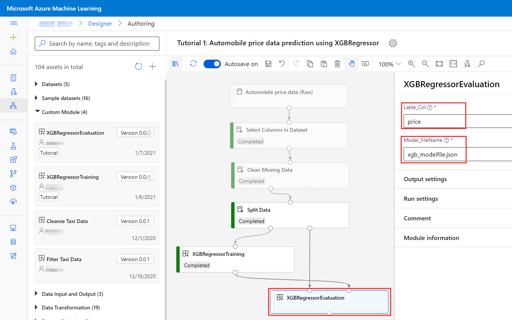

# Tutorial 2: Create your own component
In [tutorial 1](./tutorial1-use-existing-components.md), you have created a pipeline which is constructed by built-in modules and existing components in this gallery. In this tutorial, you will continue this story to introduce how to create your own component. 

## Component example
In [tutorial 1](./tutorial1-use-existing-components.md), you registered __XGBRegressorTraining__ component from gallery to your workspace. Let's use this component as an example to understand the structure of a component.

In general, Azure Machine Learning component is constituted by 2 files: 
1. Component specification in Yaml format. [__XGBRegressorTraining__](../components/automobile-price-prediction/xgboost-regressor-training/XGBRegressorTraining.spec.yaml) is the Yaml file in the example . This file defines the component with 4 sections:
    - Metadata: e.g. __name, display_name, type, tags__.
    - Interface: __inputs__ and __outputs__ of the component.
    - Implementation: For CommandComponent, __command__ is the 1-line command which will be executed.
    - Environment: __environment__ section defines the docker image and other dependencies.
2. Relative Python code which includes your own logic. [__XGBRegressorTraining__](../components/automobile-price-prediction/xgboost-regressor-training/XGBRegressorTraining.py) is the python file for our example.

The correlation between component UI, Yaml spec and Py code is illustrated as below:


Useful tips about the Yaml spec:
> - Component name constraints. 
> _Name_ is the unique identifier across all components. Currently, name only accepts letters, numbers and '-._'.

> - Component type & schema. 
> Currently, Azure Machine Learning component only supports __CommandComponent__. The _schema_ and _type_ settings are fixed values right now to support CommandComponent.

> - Data interface. 
> __DataFrameDirectory__ is the common data interface when uses Azure Machine Learning datasets across different components. This type could be easily transformed to Pandas DataFrame. It is suggested to use DataFrameDirectory as the data inputs/outputs when you define your components.

> - Port & Parameters between UI and Yaml Spec.
> From component UI, there are 2 types of inputs/outputs: __Ports__ and __Parameters__.
> 
> 
>   When you use _DataFrameDirectory_ or _AnyDirectory_ as an input/output type, it will show as __port__. When you use basic type, like _integer_, _float_ or _string_, it will show in __parameters__ right panel. 

You can refer to '_[component spec definition](../component-spec-definition.md)_' for more details about the Yaml Spec settings and examples.

## Build XGBRegressorEvaluation component
Let's start creating a new component! After you train the XGBoost regressor model for predicting automobile price, you need to have a new component, __XGBRegressorEvaluation__, to evaluate the performance of this model. We can define this new evaluation component interface as below:


### Yaml spec
Now, you can try to create Yaml file for this component to fit XGBRegressorEvaluation definition. Copy the [__Yaml template__](./resources/component_yaml_template.yaml) to start and then refer to [XGBRegressorTraining](../components/automobile-price-prediction/xgboost-regressor-training/XGBRegressorTraining.spec.yaml) Yaml example to help you fill in the content. You can also check the finalized yaml spec [__XGBRegressorEvaluation__](../components/automobile-price-prediction/xgboost-regressor-evaluation/XGBRegressorEvaluation.spec.yaml) when you finish your file or need some suggestions.

### Py code
You will use 'Root-Mean-Square Error (RMSE)' from sklearn.metrics. Now, the core pseudo code to evaluate a given model is illustrated as below:
```python
## Load model
import xgboost as xgb
xg_reg = xgb.XGBRegressor()
xg_reg.load_model("xgboost_modelfile.json")

## Evaluation
import numpy as np
from sklearn.metrics import mean_squared_error
preds = xg_reg.predict(evaluationData_features)
rmse = np.sqrt(mean_squared_error(evaluationData_lable, preds))
print("RMSE: %f" % (rmse))
```

Follow 2 steps below to upgrade these pseudo code to fit XGBRegressorEvaluation defination: 
1. Parse the inputs from args. Generally, use 'argparse.ArgumentParser' and 'add_argument' to get all input values from command.
2. Prepare your data for prediction and evaluation. Leverage 'load_data_frame_from_directory' to convert input 'DataFrameDirectory' data to Pandas DataFrame.

You can try to follow the [XGBRegressorTraining](../components/automobile-price-prediction/xgboost-regressor-training/XGBRegressorTraining.py) py code for an example. We also prepared a finalized [__XGBRegressorEvaluation py code__](../components/automobile-price-prediction/xgboost-regressor-evaluation/XGBRegressorEvaluation.py) for your reference.

## Register component from local
When the Yaml Spec and Py code are ready, you can either edit them from example or download them from [this folder](../components/automobile-price-prediction/xgboost-regressor-evaluation/) directly. Follow the registration guidance in [tutorial 1](./tutorial1-use-existing-components.md) to register the XGBRegressorEvaluation component on Azure Machine Learning Modules page. The only difference is that you need to register the component from 'Local files' and choose the right path which contains the Yaml Spec and Py code:


Then click 'Next' and 'Create' to finish the creation of XGBRegressorEvaluation component. You will see the new component is listed in Modules page.


## Update pipeline
Now let's use the new component to evaluate the output model from the pipeline we created in tutorial 1.  

Go to the 'Designer' page, select Tutorial 1 pipeline, and find the XGBRegressorEvaluation component under 'Custom Module' collection:


Drag this component to the canvas and link it to precedent components and define its parameter values:
 - The second output of __'Split Data'__ component is the data input as evaluation data set.
 - __'XGBRegressorTraining'__ output the model directory. This is the input model directory for XGBRegressorEvaluation component.
 - Put __'price'__ as the value of __'Lable_Col'__.
 - Put __'xgb_modelfile.json'__ as the value of __'Model_FileName'__. This should be aligned with XGBRegressorTraining model file defination.



Now you can submit the new pipeline with new component to evaluate the model performance.

## Contribute to the gallery
Azure Machine Learning Gallery always welcomes contributor to enrich the gallery with more components or pipelines. Once your component is ready to serve your scenario, please consider sharing it into the gallery. Refer to this [__link__](../components/README.md) to start sharing your component into gallery.
